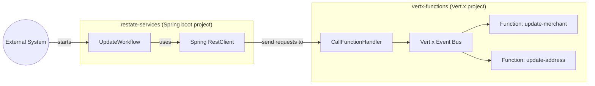
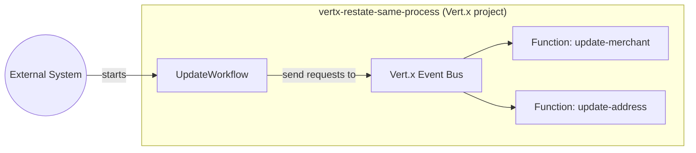

# Vert.x + Restate

## Deploy Restate services with Spring Boot and call Vert.x functions

This example is composed by two projects: 

* A Vert.x project exposing some functions on the event bus, similar to the microdose framework. The project exposes an HTTP server on port 8081, allowing Vert.x functions can be called from outside. See [CallFunctionHandler](./vertx-functions/src/main/java/my/example/vertx/CallFunctionHandler.java) for more details.
* A Spring boot project, containing a Restate service called [UpdateWorkflow](./restate-services/src/main/java/com/example/restatestarter/UpdateWorkflow.java), which invokes various Vert.x functions.

## Deploy Restate services within Vert.x

The project [vertx-restate-same-process](vertx-restate-same-process) contains an example where the [UpdateWorkflow](./vertx-restate-same-process/src/main/java/my/example/UpdateWorkflow.java) is deployed together with the Vert.x functions.
[RestateSdkVerticle](./vertx-restate-same-process/src/main/java/my/example/RestateSdkVerticle.java) shows how to set up the Restate SDK inside an already existing Vert.x project.

