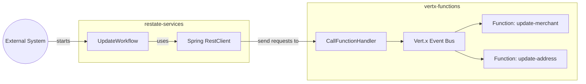

# Vert.x + Restate

This repo contains two separate projects:

* A Vert.x project exposing some functions on the event bus, similar to the microdose framework. The project exposes an HTTP server on port 8081, allowing Vert.x functions can be called from outside. See [CallFunctionHandler](./vertx-functions/src/main/java/my/example/vertx/CallFunctionHandler.java) for more details.
* A Spring boot project, containing a Restate service called [UpdateWorkflow](./restate-services/src/main/java/com/example/restatestarter/UpdateWorkflow.java), which invokes various Vert.x functions.

